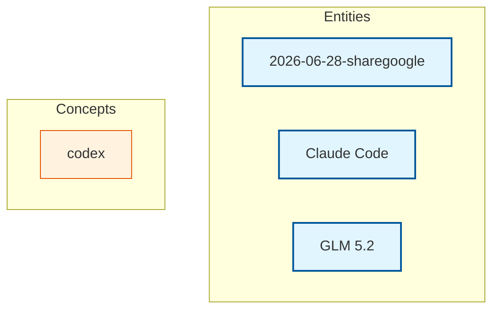

# Knowledge Graph

Last updated: 2026-06-28T18:39:21.771049

> Mermaid flowchart (TD layout) — click a node to open the page. Entities are blue, concepts are orange. Edges are wikilinks. Zoom: scroll, Pan: drag background.

## Canonical Entities

- [[claude-code|Claude Code]]
- [[glm-5-2|GLM 5.2]]

## Other Entity Pages (1)

- [[2026-06-28-sharegoogle]]

## Concepts (1)

- [[codex]]

---
Total pages: 4 | Edges: 0