# Knowledge Graph

Last updated: 2026-06-28T00:46:30.810573

> Mermaid flowchart — entities are blue, concepts are orange. Edges represent wikilink references.

```mermaid
flowchart LR
    classDef entity fill:#e1f5fe,stroke:#01579b,stroke-width:2px;
    classDef concept fill:#fff3e0,stroke:#e65100,stroke-width:1px;

    subgraph Entities
        p_2026_06_26_ai_sakana_fugu_fable_5mythos_5["2026-06-26-ai-sakana-fugu-fable-5mythos-5"]
        class p_2026_06_26_ai_sakana_fugu_fable_5mythos_5 entity
        p_2026_06_26_api_mac_ai_agent_ipad_app["2026-06-26-api-mac-ai-agent-ipad-app"]
        class p_2026_06_26_api_mac_ai_agent_ipad_app entity
        p_2026_06_26_chatgptgemini_windows_11["2026-06-26-chatgptgemini-windows-11"]
        class p_2026_06_26_chatgptgemini_windows_11 entity
        p_2026_06_26_cloudflare_temporary_accounts_ai_agent["2026-06-26-cloudflare-temporary-accounts-ai-agent"]
        class p_2026_06_26_cloudflare_temporary_accounts_ai_agent entity
        p_2026_06_26_codex_bug_ssd["2026-06-26-codex-bug-ssd"]
        class p_2026_06_26_codex_bug_ssd entity
        p_2026_06_26_hermes_agent_learn_ai["2026-06-26-hermes-agent-learn-ai"]
        class p_2026_06_26_hermes_agent_learn_ai entity
        p_2026_06_26_log_id["2026-06-26-log-id"]
        class p_2026_06_26_log_id entity
        p_2026_06_27_新北淡水隱藏版愛心景點爆紅退潮限定心型石滬美到像國外["2026-06-27-新北淡水隱藏版愛心景點爆紅退潮限定心型石滬美到像國外"]
        class p_2026_06_27_新北淡水隱藏版愛心景點爆紅退潮限定心型石滬美到像國外 entity
        anges_ai["Anges AI"]
        class anges_ai entity
        anthropic["Anthropic"]
        class anthropic entity
        antigravity["Antigravity"]
        class antigravity entity
        apple_silicon["Apple Silicon"]
        class apple_silicon entity
        chatgpt["ChatGPT"]
        class chatgpt entity
        claude_code["Claude Code"]
        class claude_code entity
        cloudflare["Cloudflare"]
        class cloudflare entity
        codex["Codex"]
        class codex entity
        cometapi["CometAPI"]
        class cometapi entity
        cursor["Cursor"]
        class cursor entity
        deepseek["DeepSeek"]
        class deepseek entity
        gemini["Gemini"]
        class gemini entity
        github["GitHub"]
        class github entity
        glm_5_2["GLM 5.2"]
        class glm_5_2 entity
        harness["Harness"]
        class harness entity
        hermes_agent["Hermes Agent"]
        class hermes_agent entity
        hermes_os["Hermes OS"]
        class hermes_os entity
        inside["Inside"]
        class inside entity
        lushbinary["LushBinary"]
        class lushbinary entity
        minimax_m3["MiniMax M3"]
        class minimax_m3 entity
        mistral_ai["Mistral AI"]
        class mistral_ai entity
        motioner["Motioner"]
        class motioner entity
        newmobilelife["newmobilelife"]
        class newmobilelife entity
        nous_research["Nous Research"]
        class nous_research entity
        openclaw["OpenClaw"]
        class openclaw entity
        openrouter["OpenRouter"]
        class openrouter entity
        paul_kuo["Paul Kuo"]
        class paul_kuo entity
        poyin_chen["PoYin Chen"]
        class poyin_chen entity
        qwen["Qwen"]
        class qwen entity
        rc_astro["RC Astro"]
        class rc_astro entity
        sakana_ai["Sakana AI"]
        class sakana_ai entity
        sakana_fugu["Sakana Fugu"]
        class sakana_fugu entity
        siliconflow["SiliconFlow"]
        class siliconflow entity
        z_ai["Z.AI"]
        class z_ai entity
    end

    subgraph Concepts
        p_2026_06_26_1107["2026-06-26-1107"]
        class p_2026_06_26_1107 concept
        p_2026_06_26_40["2026-06-26-40"]
        class p_2026_06_26_40 concept
        p_2026_06_26_450["2026-06-26-450"]
        class p_2026_06_26_450 concept
        p_2026_06_26_8_udn["2026-06-26-8-udn"]
        class p_2026_06_26_8_udn concept
        p_2026_06_26_hermes_agent_hermes_os_20100_stars_facebook["2026-06-26-hermes-agent-hermes-os-20100-stars-facebook"]
        class p_2026_06_26_hermes_agent_hermes_os_20100_stars_facebook concept
        p_2026_06_26_motioner["2026-06-26-motioner"]
        class p_2026_06_26_motioner concept
        p_2026_06_26_poyin_chen_motion_designer_taiwan["2026-06-26-poyin-chen-motion-designer-taiwan"]
        class p_2026_06_26_poyin_chen_motion_designer_taiwan concept
        p_2026_06_26_stand_alone_rc_astro_tools_rc_astro["2026-06-26-stand-alone-rc-astro-tools-rc-astro"]
        class p_2026_06_26_stand_alone_rc_astro_tools_rc_astro concept
        p_2026_06_26_wwwinsidecomtw["2026-06-26-wwwinsidecomtw"]
        class p_2026_06_26_wwwinsidecomtw concept
        p_2026_06_27_antigravity_cliagy_antigravity["2026-06-27-antigravity-cliagy-antigravity"]
        class p_2026_06_27_antigravity_cliagy_antigravity concept
        p_2026_06_27_api_siliconflow["2026-06-27-api-siliconflow"]
        class p_2026_06_27_api_siliconflow concept
        p_2026_06_27_claude_taiwan_ai_facebook["2026-06-27-claude-taiwan-ai-facebook"]
        class p_2026_06_27_claude_taiwan_ai_facebook concept
        p_2026_06_27_codex_claude_paul_kuo["2026-06-27-codex-claude-paul-kuo"]
        class p_2026_06_27_codex_claude_paul_kuo concept
        p_2026_06_27_developers_digest_ai_development_tutorials_tools_open_source["2026-06-27-developers-digest-ai-development-tutorials-tools-open-source"]
        class p_2026_06_27_developers_digest_ai_development_tutorials_tools_open_source concept
        p_2026_06_27_glm_52["2026-06-27-glm-52"]
        class p_2026_06_27_glm_52 concept
        p_2026_06_27_glm_52_api_pricing_benchmarks["2026-06-27-glm-52-api-pricing-benchmarks"]
        class p_2026_06_27_glm_52_api_pricing_benchmarks concept
        p_2026_06_27_glm_52_cometapi_cometapi_api_ai["2026-06-27-glm-52-cometapi-cometapi-api-ai"]
        class p_2026_06_27_glm_52_cometapi_cometapi_api_ai concept
        p_2026_06_27_glm_52deepseek_4qwen_37minimax_m3["2026-06-27-glm-52deepseek-4qwen-37minimax-m3"]
        class p_2026_06_27_glm_52deepseek_4qwen_37minimax_m3 concept
        p_2026_06_27_harness_engineering_for_coding_agent_users["2026-06-27-harness-engineering-for-coding-agent-users"]
        class p_2026_06_27_harness_engineering_for_coding_agent_users concept
        p_2026_06_27_lushbinary_your_ai_tech_partner["2026-06-27-lushbinary-your-ai-tech-partner"]
        class p_2026_06_27_lushbinary_your_ai_tech_partner concept
        p_2026_06_27_moco_lee["2026-06-27-moco-lee"]
        class p_2026_06_27_moco_lee concept
        p_2026_06_27_newmobilelife_newmobilelife["2026-06-27-newmobilelife-newmobilelife"]
        class p_2026_06_27_newmobilelife_newmobilelife concept
        p_2026_06_27_one_api_access_500_ai_models_cometapi["2026-06-27-one-api-access-500-ai-models-cometapi"]
        class p_2026_06_27_one_api_access_500_ai_models_cometapi concept
        p_2026_06_27_openrouter["2026-06-27-openrouter"]
        class p_2026_06_27_openrouter concept
        p_2026_06_27_pricing_overview_zai_developer_document["2026-06-27-pricing-overview-zai-developer-document"]
        class p_2026_06_27_pricing_overview_zai_developer_document concept
        p_2026_06_27_quick_start_overview_zai_developer_document["2026-06-27-quick-start-overview-zai-developer-document"]
        class p_2026_06_27_quick_start_overview_zai_developer_document concept
        p_2026_06_27_sharegoogle["2026-06-27-sharegoogle"]
        class p_2026_06_27_sharegoogle concept
        p_2026_06_27_siliconflow_ai["2026-06-27-siliconflow-ai"]
        class p_2026_06_27_siliconflow_ai concept
        p_2026_06_27_threads_post["2026-06-27-threads-post"]
        class p_2026_06_27_threads_post concept
        p_2026_06_27_yahoo["2026-06-27-yahoo"]
        class p_2026_06_27_yahoo concept
    end

    anges_ai --> hermes_agent
    anges_ai --> openclaw
    anthropic --> p_2026_06_26_ai_sakana_fugu_fable_5mythos_5
    anthropic --> sakana_fugu
    chatgpt --> gemini
    claude_code --> p_2026_06_26_codex_bug_ssd
    codex --> claude_code
    codex --> cursor
    codex --> paul_kuo
    cursor --> codex
    cursor --> p_2026_06_26_codex_bug_ssd
    deepseek --> minimax_m3
    deepseek --> qwen
    gemini --> chatgpt
    gemini --> p_2026_06_26_chatgptgemini_windows_11
    github --> hermes_agent
    github --> p_2026_06_26_hermes_agent_hermes_os_20100_stars_facebook
    github --> p_2026_06_26_log_id
    glm_5_2 --> z_ai
    hermes_agent --> github
    hermes_agent --> hermes_os
    hermes_agent --> nous_research
    hermes_os --> hermes_agent
    hermes_os --> p_2026_06_26_hermes_agent_hermes_os_20100_stars_facebook
    inside --> mistral_ai
    lushbinary --> p_2026_06_27_lushbinary_your_ai_tech_partner
    minimax_m3 --> deepseek
    minimax_m3 --> p_2026_06_27_glm_52deepseek_4qwen_37minimax_m3
    mistral_ai --> inside
    mistral_ai --> p_2026_06_26_wwwinsidecomtw
    newmobilelife --> p_2026_06_27_newmobilelife_newmobilelife
    nous_research --> hermes_agent
    nous_research --> p_2026_06_26_hermes_agent_learn_ai
    openclaw --> anges_ai
    openclaw --> p_2026_06_26_log_id
    p_2026_06_26_ai_sakana_fugu_fable_5mythos_5 --> anthropic
    p_2026_06_26_ai_sakana_fugu_fable_5mythos_5 --> sakana_ai
    p_2026_06_26_ai_sakana_fugu_fable_5mythos_5 --> sakana_fugu
    p_2026_06_26_api_mac_ai_agent_ipad_app --> apple_silicon
    p_2026_06_26_chatgptgemini_windows_11 --> chatgpt
    p_2026_06_26_chatgptgemini_windows_11 --> gemini
    p_2026_06_26_cloudflare_temporary_accounts_ai_agent --> cloudflare
    p_2026_06_26_codex_bug_ssd --> claude_code
    p_2026_06_26_codex_bug_ssd --> codex
    p_2026_06_26_codex_bug_ssd --> cursor
    p_2026_06_26_hermes_agent_hermes_os_20100_stars_facebook --> github
    p_2026_06_26_hermes_agent_hermes_os_20100_stars_facebook --> hermes_agent
    p_2026_06_26_hermes_agent_hermes_os_20100_stars_facebook --> hermes_os
    p_2026_06_26_hermes_agent_learn_ai --> hermes_agent
    p_2026_06_26_hermes_agent_learn_ai --> nous_research
    p_2026_06_26_log_id --> anges_ai
    p_2026_06_26_log_id --> hermes_agent
    p_2026_06_26_log_id --> openclaw
    p_2026_06_26_motioner --> motioner
    p_2026_06_26_poyin_chen_motion_designer_taiwan --> poyin_chen
    p_2026_06_26_wwwinsidecomtw --> inside
    p_2026_06_26_wwwinsidecomtw --> mistral_ai
    p_2026_06_27_api_siliconflow --> p_2026_06_27_siliconflow_ai
    p_2026_06_27_codex_claude_paul_kuo --> p_2026_06_26_codex_bug_ssd
    p_2026_06_27_codex_claude_paul_kuo --> paul_kuo
    p_2026_06_27_developers_digest_ai_development_tutorials_tools_open_source --> p_2026_06_27_glm_52_api_pricing_benchmarks
    p_2026_06_27_developers_digest_ai_development_tutorials_tools_open_source --> p_2026_06_27_harness_engineering_for_coding_agent_users
    p_2026_06_27_developers_digest_ai_development_tutorials_tools_open_source --> p_2026_06_27_one_api_access_500_ai_models_cometapi
    p_2026_06_27_developers_digest_ai_development_tutorials_tools_open_source --> p_2026_06_27_pricing_overview_zai_developer_document
    p_2026_06_27_developers_digest_ai_development_tutorials_tools_open_source --> p_2026_06_27_quick_start_overview_zai_developer_document
    p_2026_06_27_glm_52 --> p_2026_06_27_glm_52_api_pricing_benchmarks
    p_2026_06_27_glm_52 --> p_2026_06_27_glm_52_cometapi_cometapi_api_ai
    p_2026_06_27_glm_52 --> p_2026_06_27_glm_52deepseek_4qwen_37minimax_m3
    p_2026_06_27_glm_52_api_pricing_benchmarks --> p_2026_06_27_api_siliconflow
    p_2026_06_27_glm_52_api_pricing_benchmarks --> p_2026_06_27_developers_digest_ai_development_tutorials_tools_open_source
    p_2026_06_27_glm_52_api_pricing_benchmarks --> p_2026_06_27_glm_52
    p_2026_06_27_glm_52_api_pricing_benchmarks --> p_2026_06_27_glm_52deepseek_4qwen_37minimax_m3
    p_2026_06_27_glm_52_api_pricing_benchmarks --> p_2026_06_27_lushbinary_your_ai_tech_partner
    p_2026_06_27_glm_52_api_pricing_benchmarks --> p_2026_06_27_one_api_access_500_ai_models_cometapi
    p_2026_06_27_glm_52_api_pricing_benchmarks --> p_2026_06_27_quick_start_overview_zai_developer_document
    p_2026_06_27_glm_52_cometapi_cometapi_api_ai --> p_2026_06_27_glm_52
    p_2026_06_27_glm_52_cometapi_cometapi_api_ai --> p_2026_06_27_glm_52deepseek_4qwen_37minimax_m3
    p_2026_06_27_glm_52_cometapi_cometapi_api_ai --> p_2026_06_27_one_api_access_500_ai_models_cometapi
    p_2026_06_27_glm_52_cometapi_cometapi_api_ai --> p_2026_06_27_quick_start_overview_zai_developer_document
    p_2026_06_27_glm_52deepseek_4qwen_37minimax_m3 --> minimax_m3
    p_2026_06_27_glm_52deepseek_4qwen_37minimax_m3 --> p_2026_06_27_glm_52
    p_2026_06_27_glm_52deepseek_4qwen_37minimax_m3 --> p_2026_06_27_glm_52_api_pricing_benchmarks
    p_2026_06_27_glm_52deepseek_4qwen_37minimax_m3 --> p_2026_06_27_glm_52_cometapi_cometapi_api_ai
    p_2026_06_27_glm_52deepseek_4qwen_37minimax_m3 --> qwen
    p_2026_06_27_harness_engineering_for_coding_agent_users --> p_2026_06_27_developers_digest_ai_development_tutorials_tools_open_source
    p_2026_06_27_harness_engineering_for_coding_agent_users --> p_2026_06_27_glm_52deepseek_4qwen_37minimax_m3
    p_2026_06_27_lushbinary_your_ai_tech_partner --> p_2026_06_27_glm_52_cometapi_cometapi_api_ai
    p_2026_06_27_lushbinary_your_ai_tech_partner --> p_2026_06_27_one_api_access_500_ai_models_cometapi
    p_2026_06_27_newmobilelife_newmobilelife --> p_2026_06_27_threads_post
    p_2026_06_27_one_api_access_500_ai_models_cometapi --> p_2026_06_27_developers_digest_ai_development_tutorials_tools_open_source
    p_2026_06_27_one_api_access_500_ai_models_cometapi --> p_2026_06_27_glm_52_cometapi_cometapi_api_ai
    p_2026_06_27_pricing_overview_zai_developer_document --> p_2026_06_27_developers_digest_ai_development_tutorials_tools_open_source
    p_2026_06_27_pricing_overview_zai_developer_document --> z_ai
    p_2026_06_27_quick_start_overview_zai_developer_document --> p_2026_06_26_api_mac_ai_agent_ipad_app
    p_2026_06_27_quick_start_overview_zai_developer_document --> p_2026_06_27_developers_digest_ai_development_tutorials_tools_open_source
    p_2026_06_27_quick_start_overview_zai_developer_document --> p_2026_06_27_glm_52deepseek_4qwen_37minimax_m3
    p_2026_06_27_quick_start_overview_zai_developer_document --> p_2026_06_27_harness_engineering_for_coding_agent_users
    p_2026_06_27_quick_start_overview_zai_developer_document --> p_2026_06_27_pricing_overview_zai_developer_document
    p_2026_06_27_quick_start_overview_zai_developer_document --> z_ai
    p_2026_06_27_siliconflow_ai --> p_2026_06_27_api_siliconflow
    p_2026_06_27_siliconflow_ai --> p_2026_06_27_lushbinary_your_ai_tech_partner
    p_2026_06_27_threads_post --> p_2026_06_27_newmobilelife_newmobilelife
    paul_kuo --> codex
    paul_kuo --> p_2026_06_27_codex_claude_paul_kuo
    poyin_chen --> p_2026_06_26_poyin_chen_motion_designer_taiwan
    qwen --> deepseek
    qwen --> p_2026_06_27_glm_52deepseek_4qwen_37minimax_m3
    sakana_ai --> p_2026_06_26_ai_sakana_fugu_fable_5mythos_5
    sakana_ai --> sakana_fugu
    sakana_fugu --> anthropic
    sakana_fugu --> sakana_ai
    siliconflow --> p_2026_06_27_siliconflow_ai
    z_ai --> glm_5_2
    z_ai --> p_2026_06_27_pricing_overview_zai_developer_document
    z_ai --> p_2026_06_27_quick_start_overview_zai_developer_document
```

## Canonical Entities

- [[anges-ai|Anges AI]]
- [[anthropic|Anthropic]]
- [[antigravity|Antigravity]]
- [[apple-silicon|Apple Silicon]]
- [[chatgpt|ChatGPT]]
- [[claude-code|Claude Code]]
- [[cloudflare|Cloudflare]]
- [[codex|Codex]]
- [[cometapi|CometAPI]]
- [[cursor|Cursor]]
- [[deepseek|DeepSeek]]
- [[gemini|Gemini]]
- [[github|GitHub]]
- [[glm-5-2|GLM 5.2]]
- [[harness|Harness]]
- [[hermes-agent|Hermes Agent]]
- [[hermes-os|Hermes OS]]
- [[inside|Inside]]
- [[lushbinary|LushBinary]]
- [[minimax-m3|MiniMax M3]]
- [[mistral-ai|Mistral AI]]
- [[motioner|Motioner]]
- [[newmobilelife|newmobilelife]]
- [[nous-research|Nous Research]]
- [[openclaw|OpenClaw]]
- [[openrouter|OpenRouter]]
- [[paul-kuo|Paul Kuo]]
- [[poyin-chen|PoYin Chen]]
- [[qwen|Qwen]]
- [[rc-astro|RC Astro]]
- [[sakana-ai|Sakana AI]]
- [[sakana-fugu|Sakana Fugu]]
- [[siliconflow|SiliconFlow]]
- [[z-ai|Z.AI]]

## Other Entity Pages (8)

- [[2026-06-26-ai-sakana-fugu-fable-5mythos-5]]
- [[2026-06-26-api-mac-ai-agent-ipad-app]]
- [[2026-06-26-chatgptgemini-windows-11]]
- [[2026-06-26-cloudflare-temporary-accounts-ai-agent]]
- [[2026-06-26-codex-bug-ssd]]
- [[2026-06-26-hermes-agent-learn-ai]]
- [[2026-06-26-log-id]]
- [[2026-06-27-新北淡水隱藏版愛心景點爆紅退潮限定心型石滬美到像國外]]

## Concepts (30)

- [[2026-06-26-1107]]
- [[2026-06-26-40]]
- [[2026-06-26-450]]
- [[2026-06-26-8-udn]]
- [[2026-06-26-hermes-agent-hermes-os-20100-stars-facebook]]
- [[2026-06-26-motioner]]
- [[2026-06-26-poyin-chen-motion-designer-taiwan]]
- [[2026-06-26-stand-alone-rc-astro-tools-rc-astro]]
- [[2026-06-26-wwwinsidecomtw]]
- [[2026-06-27-antigravity-cliagy-antigravity]]
- [[2026-06-27-api-siliconflow]]
- [[2026-06-27-claude-taiwan-ai-facebook]]
- [[2026-06-27-codex-claude-paul-kuo]]
- [[2026-06-27-developers-digest-ai-development-tutorials-tools-open-source]]
- [[2026-06-27-glm-52]]
- [[2026-06-27-glm-52-api-pricing-benchmarks]]
- [[2026-06-27-glm-52-cometapi-cometapi-api-ai]]
- [[2026-06-27-glm-52deepseek-4qwen-37minimax-m3]]
- [[2026-06-27-harness-engineering-for-coding-agent-users]]
- [[2026-06-27-lushbinary-your-ai-tech-partner]]
- [[2026-06-27-moco-lee]]
- [[2026-06-27-newmobilelife-newmobilelife]]
- [[2026-06-27-one-api-access-500-ai-models-cometapi]]
- [[2026-06-27-openrouter]]
- [[2026-06-27-pricing-overview-zai-developer-document]]
- [[2026-06-27-quick-start-overview-zai-developer-document]]
- [[2026-06-27-sharegoogle]]
- [[2026-06-27-siliconflow-ai]]
- [[2026-06-27-threads-post]]
- [[2026-06-27-yahoo]]

---
Total pages: 72 | Edges: 115