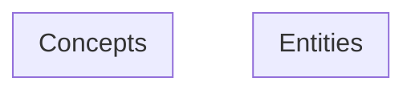

# Knowledge Graph

Last updated: 2026-06-28T14:39:12.687474

> Mermaid flowchart (TD layout) — click a node to open the page. Entities are blue, concepts are orange. Edges are wikilinks. Zoom: scroll, Pan: drag background.

---
Total pages: 0 | Edges: 0