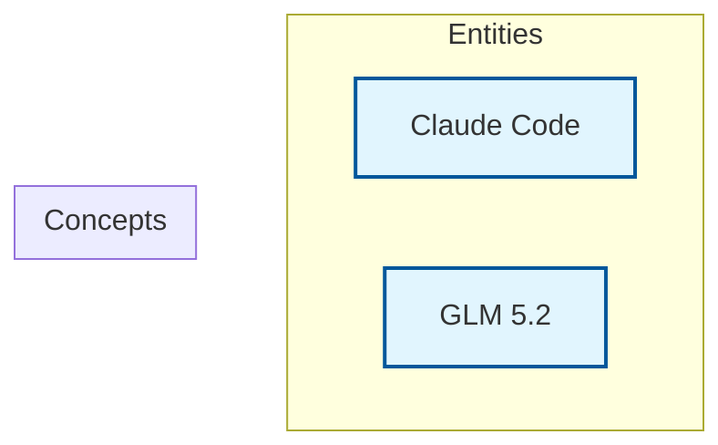

# Knowledge Graph

Last updated: 2026-06-28T18:13:46.853974

> Mermaid flowchart (TD layout) — click a node to open the page. Entities are blue, concepts are orange. Edges are wikilinks. Zoom: scroll, Pan: drag background.

## Canonical Entities

- [[claude-code|Claude Code]]
- [[glm-5-2|GLM 5.2]]

---
Total pages: 2 | Edges: 0