# Knowledge Graph

Last updated: 2026-06-28T20:11:43.789981

> Mermaid flowchart (TD layout) — click a node to open the page. Entities are blue, concepts are orange. Edges are wikilinks. Zoom: scroll, Pan: drag background.

```mermaid
%%{init: {'flowchart': {'useMaxWidth': false, 'htmlLabels': true, 'curve': 'basis', 'padding': 15}}}%%
flowchart TD
    classDef entity fill:#e1f5fe,stroke:#01579b,stroke-width:2px,cursor:pointer;
    classDef concept fill:#fff3e0,stroke:#e65100,stroke-width:1px,cursor:pointer;

    subgraph Entities
        p_2026_06_28_ai_時代非技術人最該學的設計能力把_human_sop_變成_agentic_workflow["2026-06-28-ai-時代非技術人最該學的設計能力把-human-sop-變成-agentic-workflow"]
        click p_2026_06_28_ai_時代非技術人最該學的設計能力把_human_sop_變成_agentic_workflow "entities/2026-06-28-ai-時代非技術人最該學的設計能力把-human-sop-變成-agentic-workflow.md" "Open 2026-06-28-ai-時代非技術人最該學的設計能力把-human-sop-變成-agentic-workflow"
        class p_2026_06_28_ai_時代非技術人最該學的設計能力把_human_sop_變成_agentic_workflow entity
        p_2026_06_28_reddit_please_wait_for_verification["2026-06-28-reddit-please-wait-for-verification"]
        click p_2026_06_28_reddit_please_wait_for_verification "entities/2026-06-28-reddit-please-wait-for-verification.md" "Open 2026-06-28-reddit-please-wait-for-verification"
        class p_2026_06_28_reddit_please_wait_for_verification entity
        p_2026_06_28_youtube["2026-06-28-youtube"]
        click p_2026_06_28_youtube "entities/2026-06-28-youtube.md" "Open 2026-06-28-youtube"
        class p_2026_06_28_youtube entity
        p_2026_06_28_手把手教你建立第一個_copilot_agent不用寫程式就能上線["2026-06-28-手把手教你建立第一個-copilot-agent不用寫程式就能上線"]
        click p_2026_06_28_手把手教你建立第一個_copilot_agent不用寫程式就能上線 "entities/2026-06-28-手把手教你建立第一個-copilot-agent不用寫程式就能上線.md" "Open 2026-06-28-手把手教你建立第一個-copilot-agent不用寫程式就能上線"
        class p_2026_06_28_手把手教你建立第一個_copilot_agent不用寫程式就能上線 entity
        p_2026_06_28_电脑_c_盘被挤爆删掉这_7_个隐藏垃圾瞬间腾出_200gb空间_零度解说["2026-06-28-电脑-c-盘被挤爆删掉这-7-个隐藏垃圾瞬间腾出-200gb空间-零度解说"]
        click p_2026_06_28_电脑_c_盘被挤爆删掉这_7_个隐藏垃圾瞬间腾出_200gb空间_零度解说 "entities/2026-06-28-电脑-c-盘被挤爆删掉这-7-个隐藏垃圾瞬间腾出-200gb空间-零度解说.md" "Open 2026-06-28-电脑-c-盘被挤爆删掉这-7-个隐藏垃圾瞬间腾出-200gb空间-零度解说"
        class p_2026_06_28_电脑_c_盘被挤爆删掉这_7_个隐藏垃圾瞬间腾出_200gb空间_零度解说 entity
        chatgpt["ChatGPT"]
        click chatgpt "entities/chatgpt.md" "Open ChatGPT"
        class chatgpt entity
        claude_code["Claude Code"]
        click claude_code "entities/claude-code.md" "Open Claude Code"
        class claude_code entity
        codex["Codex"]
        click codex "entities/codex.md" "Open Codex"
        class codex entity
        gemini["Gemini"]
        click gemini "entities/gemini.md" "Open Gemini"
        class gemini entity
        glm_5_2["GLM 5.2"]
        click glm_5_2 "entities/glm-5-2.md" "Open GLM 5.2"
        class glm_5_2 entity
        harness["Harness"]
        click harness "entities/harness.md" "Open Harness"
        class harness entity
        hermes_agent["Hermes Agent"]
        click hermes_agent "entities/hermes-agent.md" "Open Hermes Agent"
        class hermes_agent entity
    end

    subgraph Concepts
        p_2026_06_28_local_ai_is_finally_usable_real_world_workflows_on_a_5_year_old_mac_with_google_gemma["2026-06-28-local-ai-is-finally-usable-real-world-workflows-on-a-5-year-old-mac-with-google-gemma"]
        click p_2026_06_28_local_ai_is_finally_usable_real_world_workflows_on_a_5_year_old_mac_with_google_gemma "concepts/2026-06-28-local-ai-is-finally-usable-real-world-workflows-on-a-5-year-old-mac-with-google-gemma.md" "Open 2026-06-28-local-ai-is-finally-usable-real-world-workflows-on-a-5-year-old-mac-with-google-gemma"
        class p_2026_06_28_local_ai_is_finally_usable_real_world_workflows_on_a_5_year_old_mac_with_google_gemma concept
        p_2026_06_28_obsidian_with_ollama["2026-06-28-obsidian-with-ollama"]
        click p_2026_06_28_obsidian_with_ollama "concepts/2026-06-28-obsidian-with-ollama.md" "Open 2026-06-28-obsidian-with-ollama"
        class p_2026_06_28_obsidian_with_ollama concept
        p_2026_06_28_opencode_基本功_ep03_近乎無限的用量_opencode_go_方案心得_ai_工具分工學最聰明的模型做規劃最便宜的模型做苦工["2026-06-28-opencode-基本功-ep03-近乎無限的用量-opencode-go-方案心得-ai-工具分工學最聰明的模型做規劃最便宜的模型做苦工"]
        click p_2026_06_28_opencode_基本功_ep03_近乎無限的用量_opencode_go_方案心得_ai_工具分工學最聰明的模型做規劃最便宜的模型做苦工 "concepts/2026-06-28-opencode-基本功-ep03-近乎無限的用量-opencode-go-方案心得-ai-工具分工學最聰明的模型做規劃最便宜的模型做苦工.md" "Open 2026-06-28-opencode-基本功-ep03-近乎無限的用量-opencode-go-方案心得-ai-工具分工學最聰明的模型做規劃最便宜的模型做苦工"
        class p_2026_06_28_opencode_基本功_ep03_近乎無限的用量_opencode_go_方案心得_ai_工具分工學最聰明的模型做規劃最便宜的模型做苦工 concept
        p_2026_06_28_上班族必備零基礎_10_分鐘用_copilot_搭建_ai_代理["2026-06-28-上班族必備零基礎-10-分鐘用-copilot-搭建-ai-代理"]
        click p_2026_06_28_上班族必備零基礎_10_分鐘用_copilot_搭建_ai_代理 "concepts/2026-06-28-上班族必備零基礎-10-分鐘用-copilot-搭建-ai-代理.md" "Open 2026-06-28-上班族必備零基礎-10-分鐘用-copilot-搭建-ai-代理"
        class p_2026_06_28_上班族必備零基礎_10_分鐘用_copilot_搭建_ai_代理 concept
    end

    codex --> chatgpt
    p_2026_06_28_obsidian_with_ollama --> claude_code
    p_2026_06_28_opencode_基本功_ep03_近乎無限的用量_opencode_go_方案心得_ai_工具分工學最聰明的模型做規劃最便宜的模型做苦工 --> glm_5_2
```

## Canonical Entities

- [[chatgpt|ChatGPT]]
- [[claude-code|Claude Code]]
- [[codex|Codex]]
- [[gemini|Gemini]]
- [[glm-5-2|GLM 5.2]]
- [[harness|Harness]]
- [[hermes-agent|Hermes Agent]]

## Other Entity Pages (5)

- [[2026-06-28-ai-時代非技術人最該學的設計能力把-human-sop-變成-agentic-workflow]]
- [[2026-06-28-reddit-please-wait-for-verification]]
- [[2026-06-28-youtube]]
- [[2026-06-28-手把手教你建立第一個-copilot-agent不用寫程式就能上線]]
- [[2026-06-28-电脑-c-盘被挤爆删掉这-7-个隐藏垃圾瞬间腾出-200gb空间-零度解说]]

## Concepts (4)

- [[2026-06-28-local-ai-is-finally-usable-real-world-workflows-on-a-5-year-old-mac-with-google-gemma]]
- [[2026-06-28-obsidian-with-ollama]]
- [[2026-06-28-opencode-基本功-ep03-近乎無限的用量-opencode-go-方案心得-ai-工具分工學最聰明的模型做規劃最便宜的模型做苦工]]
- [[2026-06-28-上班族必備零基礎-10-分鐘用-copilot-搭建-ai-代理]]

---
Total pages: 16 | Edges: 3