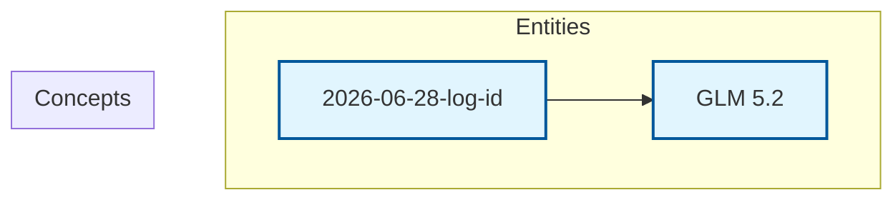

# Knowledge Graph

Last updated: 2026-06-28T15:39:13.515441

> Mermaid flowchart (TD layout) — click a node to open the page. Entities are blue, concepts are orange. Edges are wikilinks. Zoom: scroll, Pan: drag background.

## Canonical Entities

- [[glm-5-2|GLM 5.2]]

## Other Entity Pages (1)

- [[2026-06-28-log-id]]

---
Total pages: 2 | Edges: 1